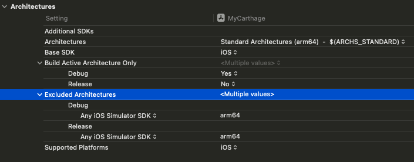

# Xcode의 시뮬레이터 빌드 문제

### 원인
Xcode12 에서 ARM기반 맥을 지원함에 따라 아이폰 시뮬레이터에도 ARM 아키텍쳐(`arm64`)가 추가되어 발생

### 해결 방법
Xcode > Build Setting 에

1. `Excluded Architectures` 에 `arm64` 를 추가
2. Xcode 12 이전에 생성된 프로젝트일 경우 `VALID_ARCHS` 제거 (Xcode 14 부터 deprecated)

### 상세 분석
**시뮬레이터는 맥에서 동작하는 특성상 맥 CPU의 아키텍쳐를 따라간다.**
Xcode 12 부터 구형 맥 (x86_64) 과 신형 맥 (arm64) 환경의 시뮬레이터를 모두 지원하기 위해 `x86_64` 와 `arm64` 두 종류의 시뮬레이터를 제공하는데,
맥과 시뮬레이터 서로간의 CPU 아키텍쳐가 맞지 않으면 당연히 실행되지 않는다.

### 만약, 실리콘 맥만 사용할 경우...
사용하는 맥이 `arm64(apple silicon)`를 사용할 경우, 시뮬레이터 빌드 최적화를 위해 x86_64 를 제외할 수 있다.

# 프레임워크 빌드 문제

### 키워드
`Architecture` - 컴퓨터의 연산을 담당하는 중앙처리장치가 사용하는 명령어 집합(ISA)을 정의하는 방식, 명령어 집합과 아키텍쳐는 약간의 차이는 있지만 아키텍쳐와 명령어 집합은 1:1 관계이므로 동의어로 취급함.

### 참고
- https://jusung.github.io/Xcode12-Build-Error/
- https://ios-development.tistory.com/1212 (Build Setting 개념)